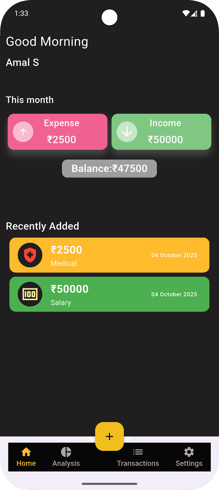

# Wallet Track

Wallet Track is a Flutter-based personal finance app that helps you manage your expenses and track transactions efficiently. It is built entirely using [Hive](https://pub.dev/packages/hive) for local data storage, ensuring fast, offline-first performance without the need for a backend.

---

## Features

- **Add Transactions:** Easily add income and expense transactions.
- **All Transactions:** View a complete list of all your transactions.
- **Analysis:** Visualize your spending with charts and analysis tools.
- **Home Dashboard:** Quick overview of your balance, recent transactions, and analytics.
- **Settings:** Manage user profile, invite friends, and access app information.
- **Offline-first:** Fully functional without internet connection using Hive for local storage.

---

## Screenshots

### Login Screen


### Home Screen


### Add Transaction Screen


### All Transactions Screen


### Analysis Screen


### Settings Screen


---

## Technologies Used

- [Flutter](https://flutter.dev/) - UI toolkit for building natively compiled applications.
- [Hive](https://pub.dev/packages/hive) - Lightweight & fast key-value database for local storage.
- [Hive Flutter](https://pub.dev/packages/hive_flutter) - Hive integration for Flutter.
- [Flutter Spinkit](https://pub.dev/packages/flutter_spinkit) - Loading animations.
- [Font Awesome Flutter](https://pub.dev/packages/font_awesome_flutter) - Icon pack.
- [Pie Chart](https://pub.dev/packages/pie_chart) & [Syncfusion Charts](https://pub.dev/packages/syncfusion_flutter_charts) - Charts for analytics.
- [Shared Preferences](https://pub.dev/packages/shared_preferences) - Store small amounts of user data.

---

## Installation

1. **Clone the repository:**

```bash
git clone <your-repo-url>
cd wallet_track

mkdir -p lib/{db,function,screens,widgets}
touch lib/db/{data_model.dart,transaction_data_model.dart}
touch lib/functions/{db_functions.dart,db_transaction_functions.dart}
touch lib/screens/{home_screen.dart,login_screen.dart,add_transaction_screen.dart,all_transaction_screen.dart,analysis_screen.dart,settings_screen.dart,name_screen.dart,about.dart,privacy_policy.dart,invite_friends.dart}
touch lib/widgets/{custom_widget.dart}
